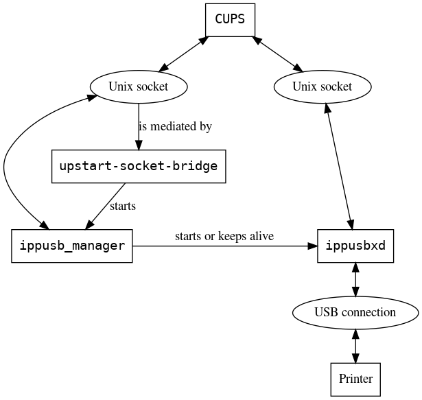

# Ippusb Manager

`ippusb_manager` provides support for IPP-over-USB printing in Chrome
OS. This is jointly achieved with
[CUPS](https://chromium.googlesource.com/chromiumos/third_party/cups/)
and with
[ippusb_bridge][ippusb_bridge].

In addition, `ippusb_bridge` is partially documented here.

[TOC]

## Overview

* The entities involved:
  * `CUPS` - the print spooler that wants to print via IPP-over-USB.
  * `ippusb_manager` - service that helps establish communication
    between the print spooler and `ippusb_bridge`. Developed specifically
    for IPP-over-USB printing in Chromium OS.
  * `ippusb_bridge` - Chromium OS system service that proxies HTTP traffic
    over USB to an IPP-over-USB printer.

## Closer look: CUPS

* The print queue URI format used for IPP-over-USB printing is
  `ippusb://<VID>_<PID>/ipp/print`.
* We have patched CUPS in Chromium OS to support the
  `ippusb://` scheme.
  * These changes apply to `lpadmin` and to the `ipp` backend.
  * If a printer uses the `ippusb://` scheme, then CUPS sends a request
    to `ippusb_manager` to broker a socket for communication with
    the printer by way of `ippusb_bridge`.
* The usage of the `ippusb://` scheme is specific to Chromium OS.
  * As this is a non-standard extension, printers don't know how to
    respond to this.
  * We retain the `ippusb://` scheme in CUPS configuration etc.
    on-device, but rewrite the URI to use the `ipp://` scheme before
    communicating with the printer.

## Closer look: ippusb\_manager

* Negotiates initial communication between `CUPS` and `ippusb_bridge`.
* Runs on demand.
  * [Started by upstart-socket-bridge][upstart-socket-bridge-conf]
    when data is written to `/run/ippusb/ippusb_manager.sock`.
* Receives a query from CUPS requesting a printer of a given
  VID and PID.
  * Searches for a printer matching given VID and PID.
  * Search outcome is determined
    * by
      [the presence of sockets exposed by ippusb_bridge][ippusb-sockets],
      `/run/ippusb/<VID>_<PID>.sock` and
      `/run/ippusb/<VID>_<PID>_keep_alive.sock`, and
    * by the liveness of `ippusb_bridge`, checked by
      [sending a keep-alive message on the latter socket][manager-sending-keep-alive].
* If necessary, [spawns an instance of ippusb_bridge][manager-spawning-bridge].
* Responds to `CUPS` with the basename of the socket over which
  it can communicate with `ippusb_bridge`.

## Closer look: keep-alive messages

* Sent from `ippusb_manager` to `ippusb_bridge` to preempt the latter
  from its timed idle exit.
* `ippusb_manager` listens for an explicit acknowledgement before
  declaring `ippusb_bridge` alive and reusing the extant sockets.
* If no acknowledgement comes, `ippusb_manager` tries to wait for the
  sockets to disappear (i.e. for `ippusb_bridge` to exit) before
  spawning a new instance.

## Closer look: ippusb\_bridge

* Is started by `ippusb_manager`, as mentioned above.
* Is always waiting to exit when idle.
  * Exits when
    [10 seconds have elapsed without activity][ippusb_bridge-timed-exit].
  * If `ippusb_bridge` receives a keep-alive from `ippusb_manager`,
    [it resets the idle timer][ippusb-idle-bump] in anticipation of
    imminent activity.
* Proxies HTTP traffic between `CUPS` and the printer via USB.
  * Allocates a thread for every incoming `ippusb` connection for a
    given printer. HTTP requests over the connection are handled one at
    a time.
  * Inspects the contents of HTTP messages in order to remove HTTP hop-by-hop
    headers (as per the HTTP spec).
  * Each client request is read completely, and forwarded to the printer. Then
    the response is completely read and returned to the client.
* Holds all available `ippusb` interfaces on the printer until exit.
  * Some printers (e.g. the Canon DX570) are known to behave erratically
    if we attempt to release interfaces when we are done with them.
* Supports receiving connections via TCP or Unix domain sockets.

## Appendix: minijail usage

* Both `ippusb_manager` and `ippusb_bridge` are run from inside minijail
  instances and retain their own seccomp filters.
* Forked processes inherit seccomp policies from their parents. Since
  `ippusb_manager` forks `ippusb_bridge`, the manager's seccomp filter must be
  a superset of ippusb\_bridge's.

## Appendix: Q&A

*(WRT ippusb_manager) why Unix sockets; why not D-Bus?*

We didn't consider D-Bus at the time. The messages are
quite simple and `CUPS` already had code for dealing with Unix sockets.

*Can a user plug in more than one USB printer?*

Yes, as long as they do not appear to be the same (i.e. present
identical VIDs and PIDs). We opine that this is an uncommon enough
use case to be an issue.

*Can ippusb_manager and ippusb_bridge have multiple clients?*

Preliminary testing indicates that this should work. Sockets are
connection-oriented, and an instance of `ippusb_bridge` is spawned for
each connected `ippusb` printer.

*Producing overview_diagram.png from overview_diagram.dot*

To generate the overview diagram for the .dot definition, run the following
commands:

`dot -Tpng overview_diagram.dot -o overview_diagram.png`

`convert overview_diagram.png -colorspace gray -quality 91 overview_diagram.png`

## Internal Documentation

Note: This documentation is only accessible to Google employees.

See the [design doc](http://go/ipp-over-usb) for information about the overall
design and how `ippusb_manager` fits into it.

For some discussion of why we migrated to `ippusb_bridge` (from `ippusbxd` as
discussed in the design doc), see
[go/ippusb-bridge-design](https://goto.google.com/ippusb-bridge-design).

## Code Overview

This repository contains the following subdirectories:

| Subdirectory | Description |
|--------------|-------------|
| `etc/init`   | Upstart config files for launching `ippusb_manager` |
| `fuzzers`    | Source files for `ippusb_manager` fuzzers |
| `seccomp`    | Seccomp Policy files for restricting syscalls |
| `udev/`      | udev rules for setting group permissions on ipp-usb printers |

[ippusb_bridge]: https://chromium.googlesource.com/chromiumos/platform2/+/HEAD/ippusb_bridge/
[upstart-socket-bridge-conf]: https://chromium.googlesource.com/chromiumos/platform2/+/HEAD/ippusb_manager/etc/init/ippusb.conf#9
[ippusb-sockets]: https://chromium.googlesource.com/chromiumos/platform2/+/HEAD/ippusb_manager/ippusb_manager.cc#44
[manager-sending-keep-alive]: https://chromium.googlesource.com/chromiumos/platform2/+/HEAD/ippusb_manager/ippusb_manager.cc#178
[manager-spawning-bridge]: https://chromium.googlesource.com/chromiumos/platform2/+/HEAD/ippusb_manager/ippusb_manager.cc#131
[ippusb_bridge-timed-exit]: https://chromium.googlesource.com/chromiumos/platform2/+/HEAD/ippusb_bridge/src/main.rs#219
[ippusb-idle-bump]: https://chromium.googlesource.com/chromiumos/platform2/+/HEAD/ippusb_bridge/src/main.rs#252
